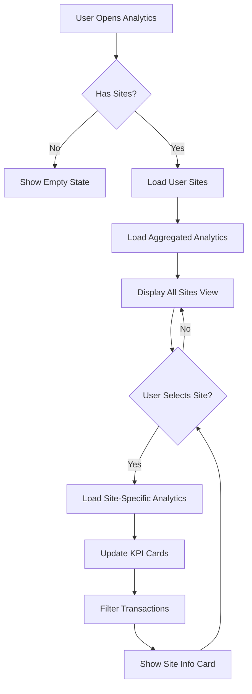
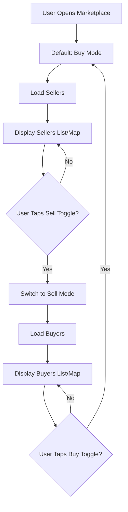
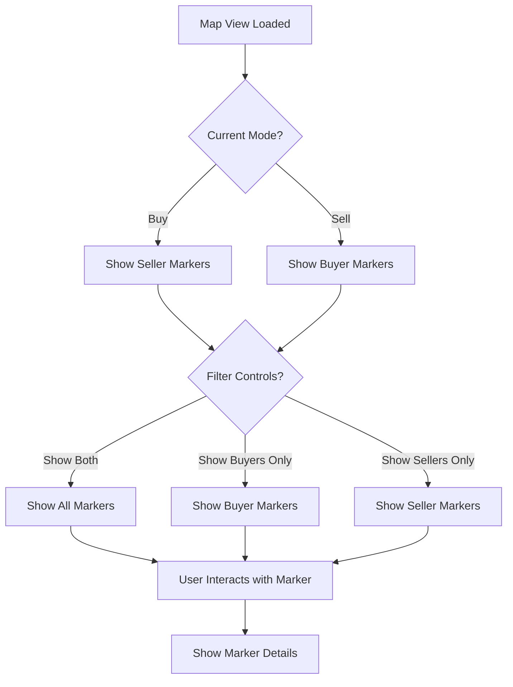

# Analytics & Marketplace Screen Redesign - Requirements Document

## Document Information
- **Version**: 1.0
- **Date**: January 2025
- **Status**: Draft for Review
- **Project**: PowerNetPro Mobile Application

---

## 1. Executive Summary

This document outlines the requirements for redesigning the **Analytics Screen** and **Marketplace Screen** to improve user experience and functionality. Key changes include:

1. **Analytics Screen**: Remove buyers/sellers section, add multi-site analytics with site selection
2. **Marketplace Screen**: Add Buy/Sell toggle, separate buyer and seller views
3. **Map View**: Add separate indicators for buyers and sellers with filtering options

---

## 2. Current State Analysis

### 2.1 Analytics Screen (Current)

**Location**: `src/screens/analytics/AnalyticsScreen.tsx`

**Current Features**:
- Header with "Buyers" and "Sellers" buttons (to be removed)
- 4 KPI cards (Energy Generated, Total Revenue, Active Trades, Efficiency)
- "Buyers & Sellers" section with horizontal scrollable lists (to be removed)
- Recent Transactions section
- Monthly Summary section

**Issues**:
- Buyers/Sellers section doesn't belong in Analytics
- No site/meter selection - shows aggregated data only
- Cannot view analytics for specific sites

### 2.2 Marketplace Screen (Current)

**Location**: `src/screens/trading/MarketplaceScreen.tsx`

**Current Features**:
- List/Map view toggle
- Seller search and filtering
- Map with seller markers
- Trade modal with Buy/Sell options (appears after selecting seller)

**Issues**:
- No Buy/Sell mode toggle at screen level
- Map shows only sellers
- Cannot filter by buyer/seller type
- User must select a seller first to choose Buy/Sell

### 2.3 Data Model

**Sites/Meters**:
- Users can have multiple meters (sites)
- Each meter has: `id`, `user_id`, `discom_name`, `consumer_number`, `meter_serial_id`, `address`
- Energy data is stored per meter: `energy_data` table with `meter_id` foreign key
- Current store: `useMeterStore` manages meters and energy data

---

## 3. Business Requirements

### BR-1: Analytics Screen Redesign
- **Requirement**: Analytics screen should focus on energy and trading performance metrics
- **Remove**: Buyers/Sellers section completely
- **Add**: Site/meter selection dropdown to view analytics per site
- **Add**: Aggregated view option (all sites combined)
- **Purpose**: Users with multiple sites need to analyze each site separately

### BR-2: Marketplace Buy/Sell Toggle
- **Requirement**: Users should be able to switch between Buy and Sell modes at the marketplace level
- **Buy Mode**: Show available sellers, allow purchasing energy
- **Sell Mode**: Show available buyers, allow listing energy for sale
- **Default**: Buy mode (most common use case)
- **Purpose**: Clear separation of buying and selling workflows

### BR-3: Map Indicators
- **Requirement**: Map should show separate indicators for buyers and sellers
- **Buyer Indicators**: Show when in Buy mode
- **Seller Indicators**: Show when in Sell mode
- **Both Indicators**: Option to show both simultaneously
- **Filtering**: Toggle to show/hide buyer or seller markers
- **Purpose**: Visual clarity for different trading types

### BR-4: Site-Based Analytics
- **Requirement**: Analytics should be filterable by site/meter
- **Site Selection**: Dropdown/picker to select specific site
- **Aggregated View**: Option to view combined analytics from all sites
- **Per-Site Metrics**: Energy generation, consumption, revenue, trades per site
- **Purpose**: Multi-site users need granular analytics

---

## 4. Functional Requirements

### 4.1 Analytics Screen Redesign

#### FR-1: Remove Buyers/Sellers Section
- **Action**: Remove the entire "Buyers & Sellers" section (lines 88-142 in current code)
- **Action**: Remove "Buyers" and "Sellers" header buttons (lines 22-37)
- **Result**: Cleaner analytics-focused interface

#### FR-2: Site Selection Component
- **Location**: Below header, above KPI cards
- **Component Type**: Dropdown/Picker or Segmented Control
- **Options**:
  - "All Sites" (aggregated view)
  - Individual site names (e.g., "Site 1 - MSEDCL", "Site 2 - Tata Power")
- **Default**: "All Sites"
- **Behavior**: 
  - When "All Sites" selected: Show aggregated metrics
  - When specific site selected: Show metrics for that site only
  - Update all KPI cards based on selection

#### FR-3: Site-Specific KPI Cards
- **Energy Generated**: 
  - All Sites: Sum of all sites
  - Single Site: Energy generated for selected site
- **Total Revenue**:
  - All Sites: Sum of all sites
  - Single Site: Revenue from selected site
- **Active Trades**:
  - All Sites: All active trades across sites
  - Single Site: Active trades for selected site
- **Efficiency**:
  - All Sites: Average efficiency across sites
  - Single Site: Efficiency for selected site

#### FR-4: Site Information Display
- **When Single Site Selected**: Show site details card
  - Site name/identifier
  - DISCOM name
  - Consumer number
  - Address
  - Registration date
- **Location**: Between site selector and KPI cards

#### FR-5: Enhanced Recent Transactions
- **Filter by Site**: When site selected, filter transactions by site
- **Site Badge**: Show site identifier in transaction list
- **All Sites View**: Show all transactions with site badges

#### FR-6: Site Comparison (Future Enhancement)
- **Note**: Out of scope for initial implementation
- **Future**: Compare metrics across multiple selected sites

---

### 4.2 Marketplace Screen Redesign

#### FR-7: Buy/Sell Toggle Button
- **Location**: Header section, prominent placement
- **Design**: Segmented control or toggle buttons
- **Options**: 
  - "Buy" (left, green)
  - "Sell" (right, orange/amber)
- **Default State**: "Buy" mode
- **Visual**: 
  - Active mode highlighted
  - Inactive mode muted
  - Icons: Shopping cart (Buy), Cash/Store (Sell)

#### FR-8: Buy Mode Functionality
- **Display**: Show available sellers (current behavior)
- **Search**: Search for sellers
- **Filters**: Filter sellers by price, rating, distance, green energy
- **Actions**: 
  - Tap seller → View details → Place order
  - Navigate to OrderScreen with seller info
- **Map**: Show seller markers only

#### FR-9: Sell Mode Functionality
- **Display**: Show available buyers (new)
- **Search**: Search for buyers looking to purchase energy
- **Filters**: Filter buyers by price range, quantity needed, distance
- **Actions**:
  - Tap buyer → View buyer details → List energy for sale
  - Navigate to SellEnergyScreen (new) or OrderScreen in sell mode
- **Map**: Show buyer markers only
- **User's Energy**: Show user's available energy from all sites

#### FR-10: Buyer Data Model
- **New Entity**: Buyers (users looking to buy energy)
- **Fields**:
  - `id`, `user_id`, `name`, `location` (lat/lng)
  - `max_price_per_unit` (maximum willing to pay)
  - `energy_needed` (kWh needed)
  - `preferred_delivery_window`
  - `rating`
- **Storage**: New `buyers` table or extend `sellers` table with type field

#### FR-11: Sell Energy Screen (New)
- **Purpose**: Allow users to list energy for sale to specific buyers
- **Fields**:
  - Select site/meter to sell from
  - Energy amount available
  - Price per unit
  - Delivery window
- **Actions**: Create listing, match with buyer

---

### 4.3 Map View Enhancements

#### FR-12: Separate Map Indicators
- **Buyer Markers**:
  - Color: Blue or Red (downward arrow icon)
  - Shape: Circle with downward arrow
  - Show when: Buy mode active OR "Show Both" enabled
- **Seller Markers**:
  - Color: Green (upward arrow icon)
  - Shape: Circle with upward arrow
  - Show when: Sell mode active OR "Show Both" enabled
- **User Location Marker**:
  - Color: Blue with pulse animation
  - Always visible

#### FR-13: Map Filter Controls
- **Location**: Overlay on map (top-right or bottom)
- **Controls**:
  - Toggle: "Show Buyers" (checkbox/switch)
  - Toggle: "Show Sellers" (checkbox/switch)
  - Toggle: "Show Both" (radio button)
- **Behavior**:
  - When "Show Both" selected: Display all markers
  - When individual toggles: Show/hide specific marker types
  - Default: Show markers based on current mode (Buy/Sell)

#### FR-14: Marker Information
- **Buyer Marker Tap**:
  - Show buyer details popup
  - Name, max price, energy needed, distance
  - "View Details" button → Buyer detail screen
- **Seller Marker Tap**:
  - Show seller details popup (existing)
  - Name, price, available energy, distance
  - "View Details" button → Seller detail screen

#### FR-15: Map Legend
- **Location**: Bottom-left corner of map
- **Content**:
  - Blue marker icon + "Buyers"
  - Green marker icon + "Sellers"
  - Blue dot + "Your Location"
- **Style**: Semi-transparent background, compact design

---

## 5. Technical Requirements

### 5.1 Database Schema Changes

#### TR-1: Buyers Table (New)
```sql
CREATE TABLE IF NOT EXISTS public.buyers (
  id UUID PRIMARY KEY DEFAULT uuid_generate_v4(),
  user_id UUID REFERENCES public.users(id) ON DELETE CASCADE NOT NULL,
  name TEXT NOT NULL,
  location JSONB, -- { lat: number, lng: number, address?: string }
  max_price_per_unit DECIMAL(10, 2) NOT NULL,
  energy_needed DECIMAL(10, 2) NOT NULL,
  preferred_delivery_window TEXT, -- e.g., "6:00 AM - 8:00 PM"
  rating DECIMAL(3, 2) DEFAULT 0 CHECK (rating >= 0 AND rating <= 5),
  status TEXT DEFAULT 'active' CHECK (status IN ('active', 'inactive', 'fulfilled')),
  created_at TIMESTAMP WITH TIME ZONE DEFAULT NOW(),
  updated_at TIMESTAMP WITH TIME ZONE DEFAULT NOW()
);

CREATE INDEX idx_buyers_user_id ON public.buyers(user_id);
CREATE INDEX idx_buyers_status ON public.buyers(status);
CREATE INDEX idx_buyers_location ON public.buyers USING GIN(location);
```

#### TR-2: Site/Meter Analytics View (Optional)
- **Purpose**: Pre-computed analytics for faster queries
- **Implementation**: Materialized view or computed on-demand
- **Fields**: Per meter analytics (generation, revenue, trades, efficiency)

---

### 5.2 Backend API Endpoints

#### TR-3: Buyers Endpoints

**GET `/marketplace/buyers`**
- **Purpose**: Get list of buyers
- **Auth**: Required
- **Query Parameters**:
  - `location` (lat, lng, radius)
  - `maxPrice` (maximum price filter)
  - `minEnergy` (minimum energy needed)
  - `status` (active/inactive)
- **Response**:
  ```json
  {
    "success": true,
    "data": [
      {
        "id": "uuid",
        "userId": "uuid",
        "name": "Buyer Name",
        "location": { "lat": 18.5204, "lng": 73.8567 },
        "maxPricePerUnit": 8.50,
        "energyNeeded": 500,
        "preferredDeliveryWindow": "6:00 AM - 8:00 PM",
        "rating": 4.5,
        "distance": 2.5
      }
    ]
  }
  ```

**POST `/marketplace/buyers`**
- **Purpose**: Create buyer listing
- **Auth**: Required
- **Request Body**:
  ```json
  {
    "maxPricePerUnit": 8.50,
    "energyNeeded": 500,
    "preferredDeliveryWindow": "6:00 AM - 8:00 PM",
    "location": { "lat": 18.5204, "lng": 73.8567 }
  }
  ```

**GET `/marketplace/buyers/:id`**
- **Purpose**: Get specific buyer details
- **Auth**: Required

**DELETE `/marketplace/buyers/:id`**
- **Purpose**: Remove buyer listing
- **Auth**: Required (must be owner)

#### TR-4: Analytics Endpoints

**GET `/analytics/sites`**
- **Purpose**: Get user's sites with basic info
- **Auth**: Required
- **Response**:
  ```json
  {
    "success": true,
    "data": [
      {
        "id": "uuid",
        "name": "Site 1",
        "discomName": "MSEDCL",
        "consumerNumber": "123456",
        "address": "Address",
        "totalGeneration": 1245.50,
        "totalRevenue": 15420.00,
        "activeTrades": 5,
        "efficiency": 94.5
      }
    ]
  }
  ```

**GET `/analytics/site/:siteId`**
- **Purpose**: Get detailed analytics for specific site
- **Auth**: Required (must be site owner)
- **Query Parameters**:
  - `startDate` (optional)
  - `endDate` (optional)
  - `period` (day/week/month/year)
- **Response**:
  ```json
  {
    "success": true,
    "data": {
      "siteId": "uuid",
      "period": "month",
      "energyGenerated": 1245.50,
      "energyConsumed": 800.25,
      "netExport": 445.25,
      "totalRevenue": 15420.00,
      "activeTrades": 5,
      "completedTrades": 24,
      "efficiency": 94.5,
      "trends": {
        "generation": "+12%",
        "revenue": "+8%"
      }
    }
  }
  ```

**GET `/analytics/aggregated`**
- **Purpose**: Get aggregated analytics across all user sites
- **Auth**: Required
- **Query Parameters**: Same as site-specific
- **Response**: Same structure as site-specific, but aggregated

---

### 5.3 Frontend Services

#### TR-5: Buyers Service
- **File**: `src/services/api/buyersService.ts` (NEW)
- **Methods**:
  - `getBuyers(filters)`
  - `getBuyer(buyerId)`
  - `createBuyerListing(data)`
  - `updateBuyerListing(buyerId, data)`
  - `deleteBuyerListing(buyerId)`

#### TR-6: Analytics Service
- **File**: `src/services/api/analyticsService.ts` (NEW)
- **Methods**:
  - `getUserSites()`
  - `getSiteAnalytics(siteId, period)`
  - `getAggregatedAnalytics(period)`
  - `getSiteEnergyData(siteId, startDate, endDate)`

#### TR-7: Marketplace Store Updates
- **File**: `src/store/marketplaceStore.ts` (NEW or extend existing)
- **State**:
  ```typescript
  {
    mode: 'buy' | 'sell',
    buyers: Buyer[],
    sellers: Seller[],
    selectedBuyer: Buyer | null,
    selectedSeller: Seller | null,
    mapFilters: {
      showBuyers: boolean,
      showSellers: boolean,
      showBoth: boolean
    }
  }
  ```

---

### 5.4 Frontend Components

#### TR-8: Site Selector Component
- **File**: `src/components/analytics/SiteSelector.tsx` (NEW)
- **Props**:
  - `sites: Site[]`
  - `selectedSiteId: string | 'all'`
  - `onSiteChange: (siteId: string | 'all') => void`
- **Design**: Dropdown or segmented control
- **Features**: 
  - "All Sites" option
  - Individual site options with names
  - Visual indicator for selected site

#### TR-9: Buy/Sell Toggle Component
- **File**: `src/components/marketplace/BuySellToggle.tsx` (NEW)
- **Props**:
  - `mode: 'buy' | 'sell'`
  - `onModeChange: (mode: 'buy' | 'sell') => void`
- **Design**: Segmented control with icons
- **Styling**: Green for Buy, Orange/Amber for Sell

#### TR-10: Map Filter Controls Component
- **File**: `src/components/mapbox/MapFilterControls.tsx` (NEW)
- **Props**:
  - `showBuyers: boolean`
  - `showSellers: boolean`
  - `showBoth: boolean`
  - `onFilterChange: (filters) => void`
- **Design**: Overlay panel with toggles

#### TR-11: Buyer Marker Component
- **File**: `src/components/mapbox/BuyerMarker.tsx` (NEW)
- **Purpose**: Custom marker for buyers on map
- **Design**: Blue circle with downward arrow icon

#### TR-12: Seller Marker Component (Update)
- **File**: `src/components/mapbox/SellerMarker.tsx` (NEW or update existing)
- **Purpose**: Custom marker for sellers on map
- **Design**: Green circle with upward arrow icon

---

### 5.5 Screen Updates

#### TR-13: Analytics Screen Updates
- **File**: `src/screens/analytics/AnalyticsScreen.tsx` (MODIFY)
- **Changes**:
  - Remove buyers/sellers section (lines 88-142)
  - Remove header buttons (lines 22-37)
  - Add SiteSelector component
  - Add site information card (conditional)
  - Update KPI calculations based on selected site
  - Filter transactions by site
  - Fetch analytics data from API

#### TR-14: Marketplace Screen Updates
- **File**: `src/screens/trading/MarketplaceScreen.tsx` (MODIFY)
- **Changes**:
  - Add BuySellToggle component in header
  - Add mode state management
  - Conditionally show buyers or sellers based on mode
  - Update map to show appropriate markers
  - Add map filter controls
  - Update search/filter logic for buyers vs sellers

#### TR-15: Sell Energy Screen (New)
- **File**: `src/screens/trading/SellEnergyScreen.tsx` (NEW)
- **Purpose**: Allow users to list energy for sale
- **Features**:
  - Site/meter selection
  - Energy amount input
  - Price per unit input
  - Delivery window selection
  - Create listing button

---

## 6. User Experience Requirements

### 6.1 Analytics Screen UX

#### UX-1: Site Selection Flow
1. User opens Analytics screen
2. Sees "All Sites" selected by default
3. Views aggregated metrics
4. Taps site selector
5. Sees list of sites + "All Sites" option
6. Selects specific site
7. Screen updates to show site-specific metrics
8. Site information card appears

#### UX-2: Empty States
- **No Sites**: Show message "Register a meter to view analytics"
- **No Data**: Show "No data available for selected period"
- **Loading**: Show skeleton loaders for KPI cards

#### UX-3: Visual Feedback
- Selected site highlighted in dropdown
- Smooth transitions when switching sites
- Loading indicators during data fetch

### 6.2 Marketplace Screen UX

#### UX-4: Mode Switching Flow
1. User opens Marketplace (default: Buy mode)
2. Sees sellers list/map
3. Taps "Sell" toggle
4. Screen transitions to Sell mode
5. Shows buyers list/map
6. User can switch back to Buy mode

#### UX-5: Map Interaction
1. User views map
2. Sees markers based on current mode
3. Taps filter controls
4. Can toggle buyer/seller visibility
5. Can enable "Show Both" to see all markers
6. Taps marker to see details
7. Taps "View Details" to see full information

#### UX-6: Buy Mode Actions
1. User in Buy mode
2. Sees list of sellers
3. Taps seller card
4. Sees seller details
5. Taps "Buy Energy"
6. Navigates to OrderScreen

#### UX-7: Sell Mode Actions
1. User in Sell mode
2. Sees list of buyers
3. Taps buyer card
4. Sees buyer details
5. Taps "Sell Energy"
6. Navigates to SellEnergyScreen
7. Selects site, enters details
8. Creates listing

---

## 7. Data Flow Diagrams

### 7.1 Analytics Screen Data Flow



### 7.2 Marketplace Mode Switching Flow



### 7.3 Map Marker Display Flow



---

## 8. Implementation Plan

### Phase 1: Analytics Screen Redesign
1. Remove buyers/sellers section from AnalyticsScreen
2. Create SiteSelector component
3. Create analyticsService
4. Add site selection logic
5. Update KPI calculations
6. Add site information card
7. Filter transactions by site
8. Test with single and multiple sites

### Phase 2: Marketplace Buy/Sell Toggle
1. Create BuySellToggle component
2. Add mode state to MarketplaceScreen
3. Update header with toggle
4. Conditionally render buyers/sellers
5. Update search logic for both modes
6. Test mode switching

### Phase 3: Buyers Functionality
1. Create buyers table in database
2. Create backend buyers endpoints
3. Create buyersService
4. Create buyer list/card components
5. Integrate with MarketplaceScreen
6. Test buyer listing and search

### Phase 4: Map Enhancements
1. Create BuyerMarker component
2. Update SellerMarker component
3. Create MapFilterControls component
4. Update MapboxWebView to support both marker types
5. Add map legend
6. Test marker display and filtering

### Phase 5: Sell Energy Screen
1. Create SellEnergyScreen
2. Add site selection
3. Add form fields
4. Integrate with backend
5. Test energy listing creation

---

## 9. Testing Requirements

### 9.1 Analytics Screen Tests
- [ ] Site selector displays all user sites
- [ ] "All Sites" shows aggregated data
- [ ] Site selection updates all KPIs
- [ ] Site information card appears for single site
- [ ] Transactions filter by selected site
- [ ] Empty states display correctly
- [ ] Loading states work properly

### 9.2 Marketplace Tests
- [ ] Buy/Sell toggle switches modes
- [ ] Buy mode shows sellers
- [ ] Sell mode shows buyers
- [ ] Search works in both modes
- [ ] Filters work in both modes
- [ ] Map shows correct markers per mode
- [ ] Map filters work correctly

### 9.3 Map Tests
- [ ] Buyer markers display correctly
- [ ] Seller markers display correctly
- [ ] Both markers show when enabled
- [ ] Marker taps show correct details
- [ ] Map legend displays
- [ ] Filter controls work

---

## 10. Open Questions

1. **Buyer Data Source**: Should buyers be:
   - Active listings from users wanting to buy?
   - Historical buyer data?
   - Both?

2. **Site Naming**: How should sites be named/identified?
   - Auto-generated (Site 1, Site 2)?
   - User-defined names?
   - DISCOM + Consumer Number?

3. **Sell Mode Default**: Should users see their own available energy in Sell mode?
   - Show available energy from all sites?
   - Allow selecting which site to sell from?

4. **Map Marker Clustering**: Should markers cluster when zoomed out?
   - Implement clustering for performance?
   - Show count badges?

5. **Analytics Period**: Should analytics support time period selection?
   - Day/Week/Month/Year filters?
   - Date range picker?

---

## 11. Future Enhancements (Out of Scope)

1. **Site Comparison**: Compare metrics across multiple sites side-by-side
2. **Advanced Analytics**: Charts, trends, predictions
3. **Buyer/Seller Matching**: AI-powered matching algorithm
4. **Notifications**: Notify when buyers match seller criteria
5. **Favorites**: Save favorite buyers/sellers
6. **History**: View historical buyer/seller data

---

## 12. Approval & Sign-off

### Review Checklist
- [ ] Business requirements reviewed
- [ ] Technical requirements reviewed
- [ ] UX flows validated
- [ ] Database schema approved
- [ ] API endpoints defined
- [ ] Implementation plan confirmed
- [ ] Open questions answered
- [ ] Timeline estimated

### Stakeholders
- **Product Owner**: ________________
- **Technical Lead**: ________________
- **UX Designer**: ________________
- **Backend Developer**: ________________

---

## Document History

| Version | Date | Author | Changes |
|---------|------|--------|---------|
| 1.0 | 2025-01-XX | Development Team | Initial requirements document |

---

**End of Document**

